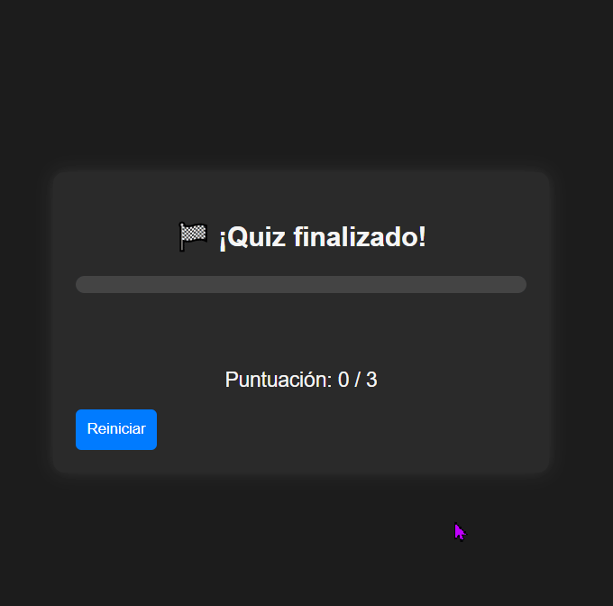

# 🧠 Ejercicio 1: Quiz cronometrado por pregunta con barra de progreso y feedback inmediato

## 📋 Descripción
Este ejercicio consiste en un **cuestionario interactivo** en el que cada pregunta tiene un **tiempo límite de 10 segundos**.  
Durante ese tiempo, una **barra de progreso** se va reduciendo visualmente.  
Cuando el usuario selecciona una respuesta, se muestra **feedback inmediato** indicando si es **correcta o incorrecta**, y tras un breve intervalo, se pasa automáticamente a la siguiente pregunta.  

Al finalizar el quiz, se muestra un **resumen con la puntuación final** y un botón para **reiniciar** el juego.

---

## 🧩 Archivos entregados
- `ejercicio1.html`  
- `ejercicio1.js`

---

## ⚙️ Funcionamiento
1. El usuario inicia automáticamente el cuestionario.  
2. Cada pregunta tiene 10 segundos para ser respondida.  
3. Si el usuario no responde a tiempo, se muestra “⏰ ¡Tiempo agotado!” y se pasa a la siguiente.  
4. Si responde correctamente, se muestra “✅ ¡Correcto!” y se suma 1 punto.  
5. Al final del quiz, se muestra la puntuación total y un botón “Reiniciar” para volver a empezar.  

---

## 🧠 Conceptos aplicados
- **Manejo de eventos** (`click` en las opciones y botón de reinicio).  
- **Manipulación del DOM** para actualizar preguntas, respuestas, tiempo y barra de progreso.  
- **Uso de temporizadores** con `setInterval` y `clearInterval`.  
- **Gestión de estado** (índice de pregunta, puntuación y temporizador).  
- **Accesibilidad básica** con `aria-live` para mensajes dinámicos.

---

## 🧪 Prueba del ejercicio
A continuación, se muestran los GIFs demostrando el funcionamiento del ejercicio:

