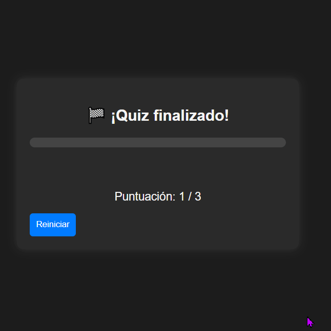
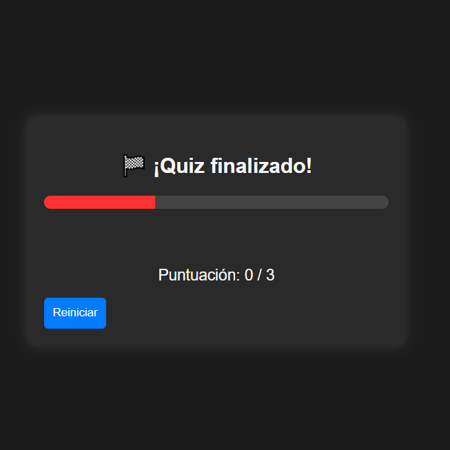
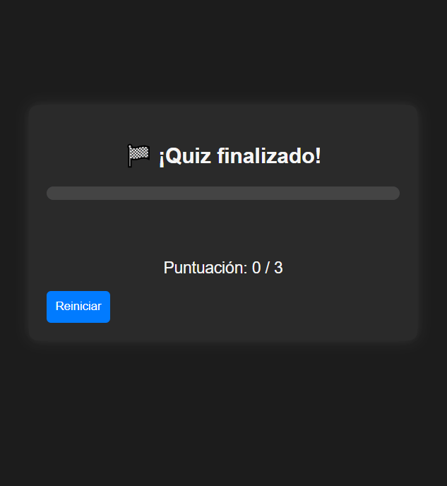
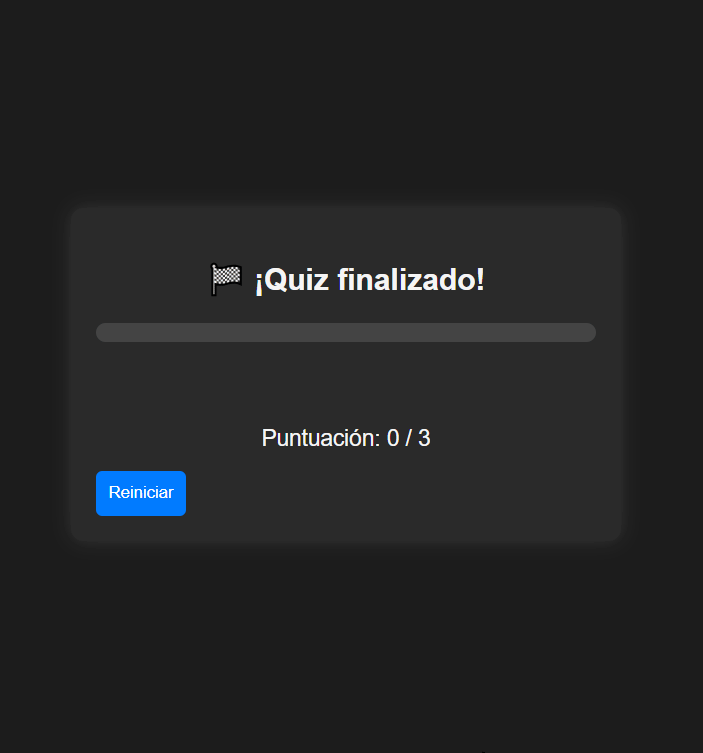
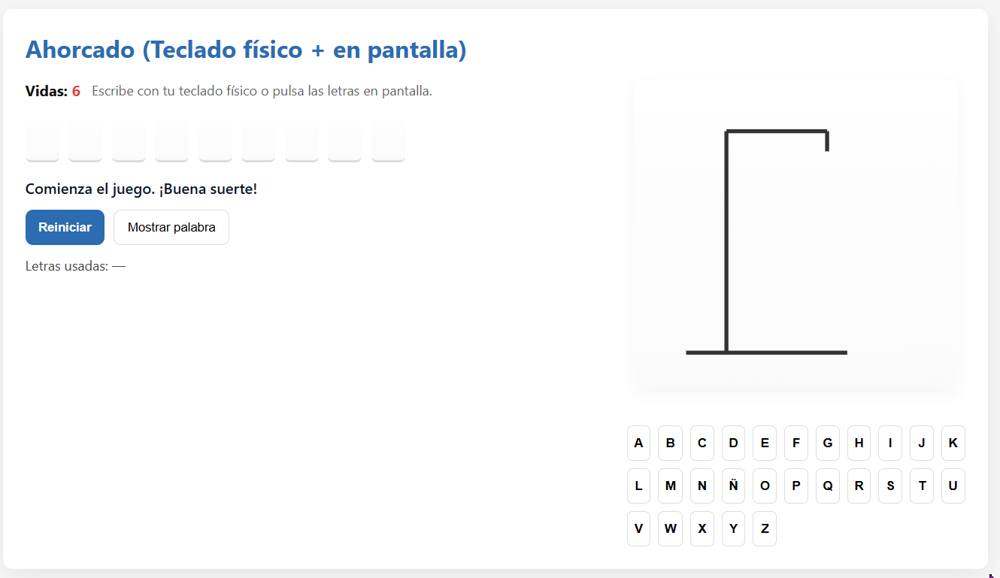
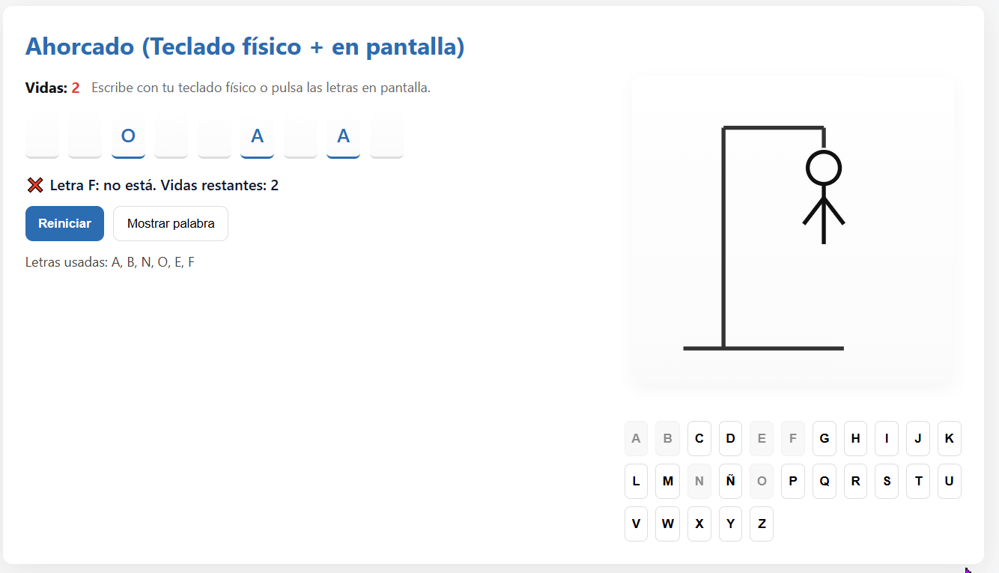
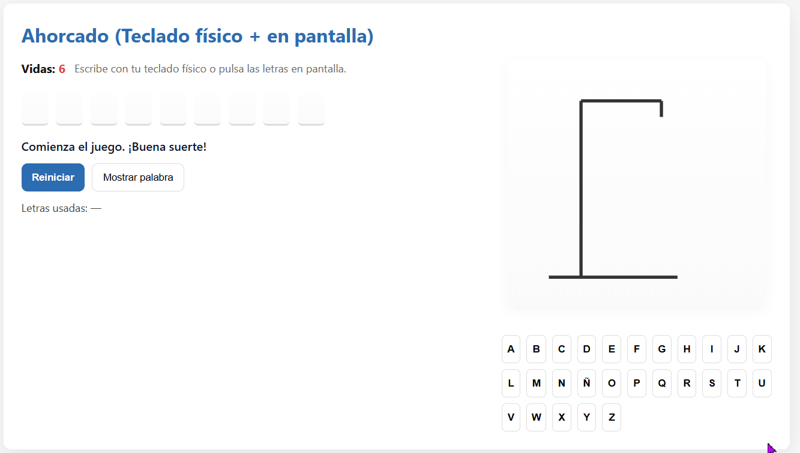
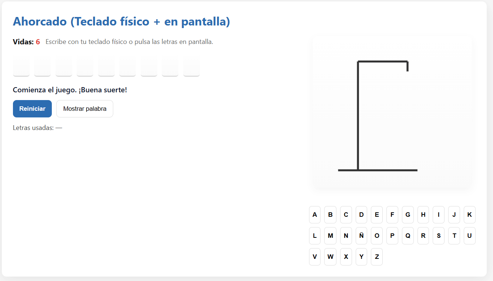
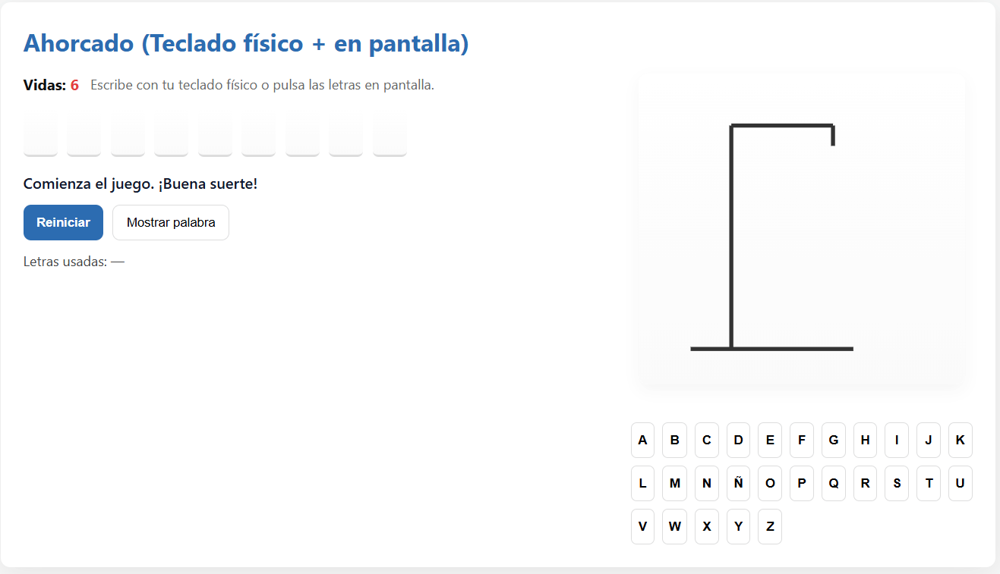
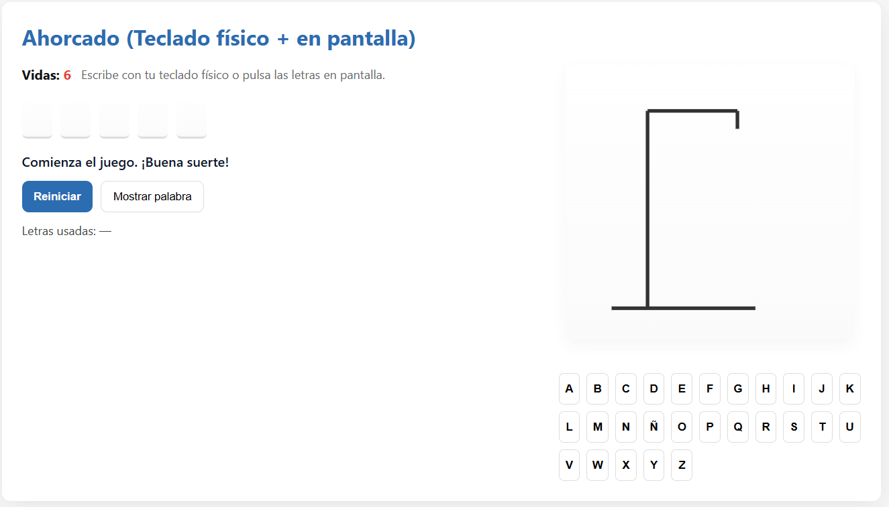

# 🧠 Ejercicio 1: Quiz cronometrado por pregunta con barra de progreso y feedback inmediato

## 📋 Descripción
Este ejercicio consiste en un **cuestionario interactivo** en el que cada pregunta tiene un **tiempo límite de 10 segundos**.  
Durante ese tiempo, una **barra de progreso** se va reduciendo visualmente.  
Cuando el usuario selecciona una respuesta, se muestra **feedback inmediato** indicando si es **correcta o incorrecta**, y tras un breve intervalo, se pasa automáticamente a la siguiente pregunta.  

Al finalizar el quiz, se muestra un **resumen con la puntuación final** y un botón para **reiniciar** el juego.

---

## 🧩 Archivos entregados
- `ejercicio1.html`  
- `ejercicio1.js`

---

## ⚙️ Funcionamiento
1. El usuario inicia automáticamente el cuestionario.  
2. Cada pregunta tiene 10 segundos para ser respondida.  
3. Si el usuario no responde a tiempo, se muestra “⏰ ¡Tiempo agotado!” y se pasa a la siguiente.  
4. Si responde correctamente, se muestra “✅ ¡Correcto!” y se suma 1 punto.  
5. Al final del quiz, se muestra la puntuación total y un botón “Reiniciar” para volver a empezar.  

---

## 🧠 Conceptos aplicados
- **Manejo de eventos** (`click` en las opciones y botón de reinicio).  
- **Manipulación del DOM** para actualizar preguntas, respuestas, tiempo y barra de progreso.  
- **Uso de temporizadores** con `setInterval` y `clearInterval`.  
- **Gestión de estado** (índice de pregunta, puntuación y temporizador).  
- **Accesibilidad básica** con `aria-live` para mensajes dinámicos.

---

## 🧪 Prueba del ejercicio
A continuación, se muestran los GIFs demostrando el funcionamiento del ejercicio:

## 1. Seleccionar la opción correcta y verificar que aparece el mensaje "Correcto" y se avanza a la siguiente pregunta.

## 2. Seleccionar una opción incorrecta y verificar que aparece “Incorrecto” con marcado visual, antes de avanzar.

## 3. No seleccionar nada y dejar que el tiempo llegue a 0; verificar “Tiempo agotado” y el avance automático.

## 4. Confirmar que la barra de progreso se reduce de lleno a vacío sincronizada con el contador (p. ej., de 10 a 0).

## 5. Completar todas las preguntas y comprobar que se muestra la puntuación final y que el botón “Reiniciar” reinicia el quiz.

----------------------------------------------------------------------------------------------------------

# 🧩 Ejercicio 2: Ahorcado con teclado físico y teclado en pantalla

## 📋 Descripción
Implementación del clásico **juego del ahorcado**, donde el usuario debe adivinar una palabra secreta letra a letra.  
El juego puede controlarse tanto con el **teclado físico** como con un **teclado en pantalla (A–Z y Ñ)**.

Cada error muestra progresivamente una parte del muñeco.  
La partida termina al **acertar toda la palabra** o **agotar las vidas**, con opción de **reiniciar** el juego.

---

## 🧩 Archivos entregados
- `ejercicio2.html`  
- `ejercicio2.js`

---

## ⚙️ Funcionamiento
1. El usuario debe completar el juego pulsando las teclas correspondientes en el teclado digital o en el físico.  
2. Tiene 6 vidas para poder completar la palabra, una vez agotadas se muestra el mensaje de derrota.  
3. Si el usuario pierde se bloquea el teclado tanto digital como físico.  
4. Si responde correctamente se bloquean las letras utilizadas y se mostrará el mensaje de victoria una vez completado.  

---

## 🧠 Objetivos del ejercicio
- Manejo combinado de eventos (`keydown` y `click`).
- Manipulación del DOM para actualizar la palabra, teclado y dibujo del muñeco.
- Control del estado del juego (vidas, letras usadas, victoria/derrota).
- Implementación accesible mediante regiones `aria-live` para mensajes dinámicos.

---

## 🧪 Prueba del ejercicio
A continuación, se muestran los GIFs demostrando el funcionamiento del ejercicio:

## 1. Pulsar varias letras en el teclado en pantalla: se deshabilitan, revelan aciertos y contabilizan fallos.

## 2. Usar el teclado físico (por ejemplo, A, E, Ñ) y verificar que actúa igual que el teclado en pantalla.

## 3.Forzar fallos para ver cómo disminuyen las vidas y aparecen, paso a paso, las partes del muñeco.

## 4. Completar la palabra y comprobar el mensaje de victoria y el bloqueo del teclado.

## 5. Agotar todas las vidas y comprobar el mensaje de derrota y el bloqueo del teclado.

## 6. Pulsar “Reiniciar” y verificar que se carga una nueva palabra y se limpia el estado.

