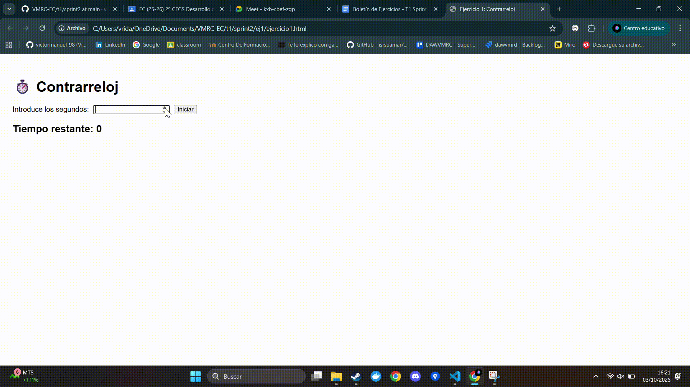
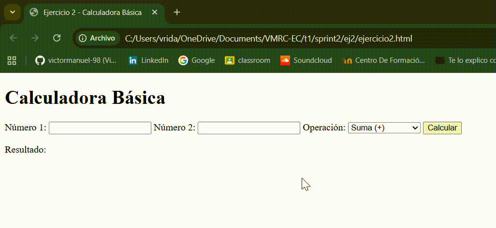
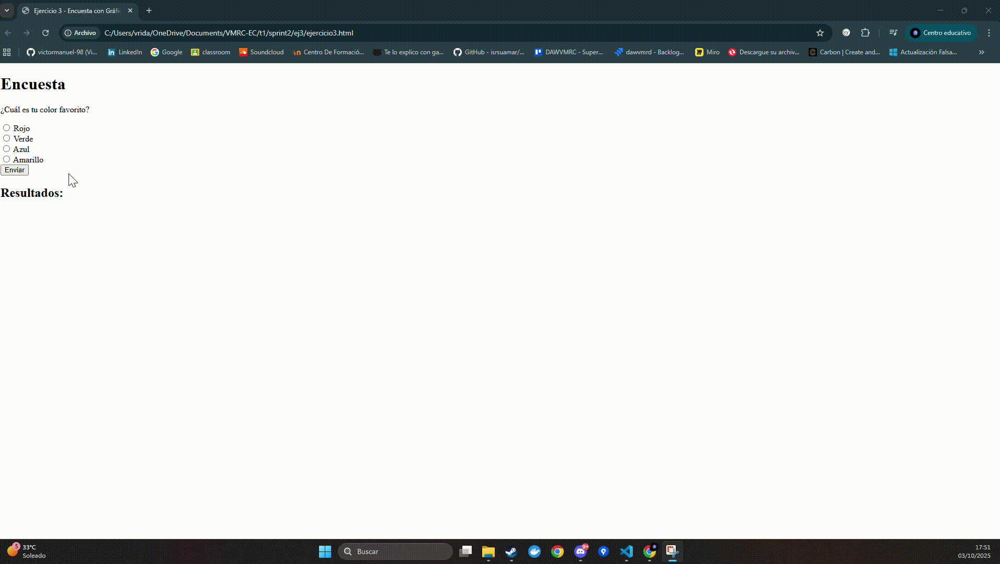
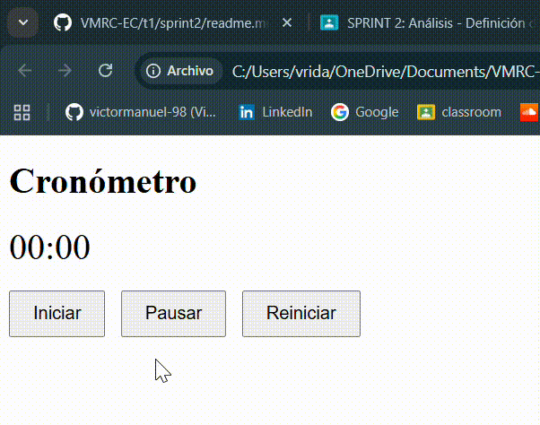

# ⏱️ Ejercicio 1: Contrarreloj

## Descripción
Este ejercicio consiste en crear un **temporizador simple** en el que el usuario puede introducir una cantidad de segundos, y al hacer clic en un botón, comienza la **cuenta regresiva**.  
Cuando el tiempo llega a cero, aparece el mensaje: **"¡Tiempo finalizado!"**.

---

## Archivos entregados
- `ejercicio1.html` → Contiene la estructura básica del temporizador.
- `ejercicio1.js` → Controla la lógica de la cuenta regresiva con `setInterval`.

---

## Instrucciones de uso
1. Abrir el archivo `ejercicio1.html` en el navegador.  
2. Escribir en el campo de texto el número de segundos a contar.  
3. Pulsar el botón **Iniciar**.  
4. El tiempo comenzará a descender hasta llegar a cero.  
5. Al finalizar se mostrará el mensaje: **¡Tiempo finalizado!**.

---

## Objetivos de aprendizaje
- Uso de **eventos** (`click`, `keydown`).  
- Manejo de **temporizadores** con `setInterval` y `clearInterval`.  
- **Manipulación del DOM** para mostrar el tiempo restante dinámicamente.  

---

## Demostración en GIF
Aquí se muestra el funcionamiento del ejercicio con un ejemplo de 5 segundos:  

# 🧮 Ejercicio 2: Calculadora Básica

## Descripción
Este ejercicio consiste en crear una **calculadora básica** que permite realizar operaciones de:
- Suma
- Resta
- Multiplicación
- División  

El usuario introduce **dos números**, selecciona la operación y al hacer clic en **Calcular**, se muestra el resultado en pantalla.  

---

## Archivos entregados
- `ejercicio2.html` → Estructura de la calculadora.  
- `ejercicio2.js` → Lógica de operaciones y control de eventos.  

---

## Instrucciones de uso
1. Abrir el archivo `ejercicio2.html` en un navegador web.  
2. Introducir dos números en los campos correspondientes.  
3. Seleccionar la operación en el menú desplegable.  
4. Pulsar el botón **Calcular**.  
5. El resultado se mostrará en la página.  

---

## Objetivos de aprendizaje
- Manejo de **eventos** (`click`).  
- **Validación de entradas** de usuario (`isNaN`).  
- Uso de **operaciones matemáticas básicas** (+, -, *, /).  
- Manipulación del **DOM** para mostrar resultados dinámicamente.  

---

## Pruebas requeridas
El GIF de demostración debe mostrar los siguientes casos de prueba:  

1. Suma de **10 + 12** → resultado `22`.  
2. Resta de **10 - 12** → resultado `-2`.  
3. Multiplicación de **5 × 4** → resultado `20`.  
4. Multiplicación de **5 × 0** → resultado `0`.  
5. División de **5 ÷ 4** → resultado `1.25`.  
6. División de **5 ÷ 0** → resultado `"INDEFINIDO"`.  

---

## Demostración en GIF
Ejemplo de funcionamiento de la calculadora:  

# 📊 Ejercicio 3: Encuesta con Gráfico de Barras

## Descripción
Este ejercicio consiste en crear una **encuesta** donde el usuario puede seleccionar una opción entre varias (por ejemplo: "¿Cuál es tu color favorito?").  
Al enviar la respuesta, se muestran los resultados en un **gráfico de barras** que se actualiza dinámicamente cada vez que se envía una nueva respuesta.

---

## Archivos entregados
- `ejercicio3.html` → Estructura de la encuesta y área de resultados.  
- `ejercicio3.js` → Lógica para contar votos y actualizar el gráfico dinámicamente.  

---

## Instrucciones de uso
1. Abrir el archivo `ejercicio3.html` en un navegador.  
2. Seleccionar una opción en la encuesta.  
3. Pulsar el botón **Enviar**.  
4. Observar cómo se actualiza el gráfico de barras mostrando los votos de cada opción.  
5. Repetir para agregar más votos y ver la actualización dinámica del gráfico.

---

## Objetivos de aprendizaje
- Manejo de **eventos** (`click`).  
- Manipulación del **DOM** para actualizar elementos dinámicamente.  
- Lógica para contar votos y representar los resultados visualmente.  

---

## Pruebas requeridas
El GIF de demostración debe mostrar al menos:  
- Selección de varias opciones y envío de votos.  
- Actualización dinámica del gráfico de barras reflejando el número de votos.  

---

## Demostración en GIF
Ejemplo de funcionamiento de la encuesta:  

# ⏱️ Ejercicio 4: Cronómetro con Controles

## Descripción
Este ejercicio consiste en crear un **cronómetro** que permite al usuario:
- Iniciarlo  
- Pausarlo  
- Reiniciarlo  

El cronómetro se actualiza cada segundo y muestra el tiempo en **minutos y segundos**.

---

## Archivos entregados
- `ejercicio4.html` → Contiene los botones de control y el display del cronómetro.  
- `ejercicio4.js` → Lógica para iniciar, pausar y reiniciar el cronómetro con `setInterval`.  

---

## Instrucciones de uso
1. Abrir el archivo `ejercicio4.html` en un navegador.  
2. Pulsar el botón **Iniciar** para que el cronómetro comience a contar.  
3. Pulsar **Pausar** para detenerlo temporalmente.  
4. Pulsar **Reiniciar** para volver a cero y detener el cronómetro.  
5. El tiempo se muestra en formato `MM:SS` en el área de display.  

---

## Objetivos de aprendizaje
- Uso avanzado de **eventos** (click en múltiples botones).  
- Manejo de **temporizadores** (`setInterval` y `clearInterval`).  
- Actualización continua del **DOM** para mostrar el tiempo dinámicamente.  

---

## Pruebas requeridas
El GIF de demostración debe mostrar:  
1. El cronómetro comienza a contar correctamente al pulsar **Iniciar**.  
2. Al pulsar **Pausar**, el cronómetro se detiene en el tiempo actual.  
3. Al pulsar **Reiniciar**, el cronómetro vuelve a cero.  
4. El cronómetro puede manejar largos períodos de tiempo sin errores.  

---

## Demostración en GIF
Ejemplo de funcionamiento del cronómetro:  

# Ejercicio 5: Juego de Memoria con Cartas

## Descripción
Este ejercicio consiste en un **juego de memoria** donde el jugador debe encontrar todas las parejas de cartas.  
Cada carta tiene una **imagen frontal** y una **imagen trasera** (`back.png`).  
El tablero tiene un **fondo tipo mesa** para hacerlo más inmersivo.  

### Funcionalidades
- Voltear cartas al hacer clic.  
- Mantener las cartas coincidentes visibles.  
- Voltear automáticamente las cartas no coincidentes después de un segundo.  
- Detectar cuando todas las parejas han sido encontradas.  
- Reiniciar el juego y barajar las cartas.  

---

## Archivos del ejercicio
- `ejercicio5.html` → Contiene la estructura HTML del juego y el contenedor de cartas.  
- `ejercicio5.js` → Contiene la lógica de juego: eventos, volteo de cartas, comparación de parejas y reinicio.  
- Carpeta `cards/` → Contiene:
  - `img1.png` … `img8.png` → imágenes de las cartas.  
  - `back.png` → imagen de la parte trasera de la carta.  
  - `mesa.png` → imagen de fondo tipo mesa.  

---

## Cómo jugar
1. Abrir `ejercicio5.html` en un navegador compatible.  
2. Hacer clic sobre cualquier carta para voltearla.  
3. Si las cartas coinciden, permanecen visibles; si no coinciden, se vuelven a ocultar automáticamente.  
4. Continuar hasta encontrar todas las parejas.  
5. Para reiniciar el juego, pulsar el botón **Reiniciar Juego**.  

---

## Pruebas
- Verificar que las cartas se voltean correctamente al hacer clic.  
- Comprobar que las cartas coincidentes permanecen visibles.  
- Comprobar que las cartas no coincidentes se vuelven a ocultar después de 1 segundo.  
- Verificar que el juego detecta cuando todas las parejas han sido encontradas y muestra el mensaje de victoria.  
- Probar que el botón de reinicio vuelve a barajar las cartas y reinicia el juego correctamente.  

---

## GIF de demostración

