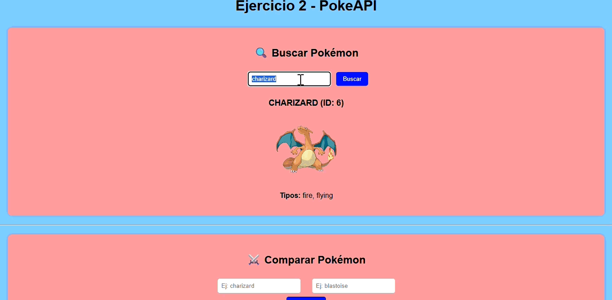

# 🧮 Ejercicio 1 - Análisis y Transformación Avanzada de Datos

Este ejercicio consiste en trabajar con un conjunto de estudiantes representados como objetos dentro de un array, aplicando distintas funciones de análisis, filtrado y transformación de datos.

---

## 📂 Estructura
- `ejercicio1.html` → Contiene la interfaz con botones para ejecutar cada parte.
- `ejercicio1.js` → Contiene las funciones y los datos de los estudiantes.

---

## 🧩 Funcionalidades
A continuación se muestran dos gifs en los que se incluyen todos las pruebas a realizar para el ejercicio.

### 1️⃣ Estudiantes Destacados por Asignatura
Muestra los **3 estudiantes con mejores notas** en una asignatura dada.

### 2️⃣ Asignatura con Menor Rendimiento
Calcula la **asignatura con el promedio más bajo** entre todos los estudiantes.

### 3️⃣ Mejora de Notas para Estudiantes con Beca
Aumenta todas las notas de los estudiantes con beca en un **10% (máximo 10).**

### 4️⃣ Filtrado por Ciudad y Asignatura
Filtra los estudiantes de una ciudad y los ordena **descendentemente** por la nota en una asignatura.

### 5️⃣ Estudiantes Sin Beca por Ciudad
Devuelve la **cantidad de estudiantes sin beca** en una ciudad.

### 6️⃣ Promedio de Edad de Estudiantes con Beca
Calcula el **promedio de edad** de los estudiantes que tienen beca.

### 7️⃣ Mejores Estudiantes en Total
Muestra los **2 estudiantes con mejor promedio general** entre todas las asignaturas.

### 8️⃣ Estudiantes con Todas las Materias Aprobadas
Devuelve un array con los **nombres de los estudiantes que aprobaron todas las materias** (nota ≥ 5).

--------------------------------------------------------------------------------------------

# 📌 Ejercicio 2 – PokeAPI
**Sprint 3 – Entorno Cliente (2º DAW)**

Este ejercicio utiliza JavaScript y la API pública **PokeAPI** para obtener y mostrar información sobre Pokémon de forma dinámica y visual.

## ✅ 1. Funcionalidades implementadas + gifs correspondientes

### 🔹 1. Buscar Pokémon
- Introducir el nombre de un Pokémon (Pikachu y Charizard).
- Muestra:
  - Nombre e ID
  - Tipo elemental
  - Imagen oficial
- Incluye manejo de errores si el Pokémon no existe o si el input está vacío.

### 🔹 2. Pokémon falso
- Comprobar si el Pokémon existe al introducir un nombre erróneo (fakepokemon).
- Se muestra:
  - Alerta de Pokémon no encontrado.
- Todo el contenido aparece centrado y bien estructurado.

### 🔹 3. Comparar Pokémon
- Introducir dos Pokémon y comparar sus estadísticas base.
- Se muestra:
  - Imagen de ambos Pokémon (a los lados de la tabla)
  - Tabla comparativa de estadísticas
  - Suma total de stats
  - Ganador o “Empate”
- Todo el contenido aparece centrado y bien estructurado.

### 🔹 3. Cadena Evolutiva + Habilidades
- Introducir un Pokémon y mostrar **toda su cadena evolutiva**.
- Cada evolución incluye:
  - Imagen oficial
  - Nombre
  - Habilidades
- Las evoluciones se muestran **en horizontal** (no en columna).
- Si el Pokémon no tiene evoluciones, se muestra un mensaje informativo.

---

