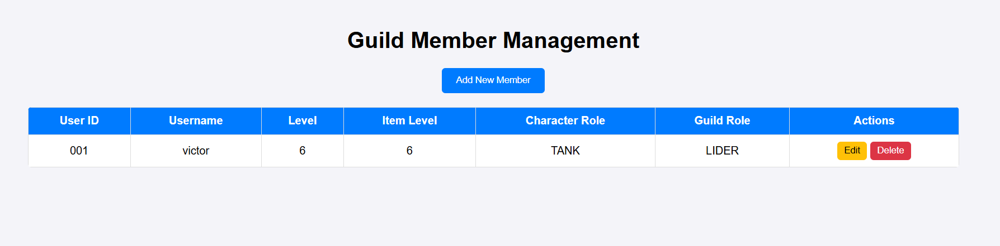

# 🧮 Ejercicio 1 - Análisis y Transformación Avanzada de Datos

Este ejercicio consiste en trabajar con un conjunto de estudiantes representados como objetos dentro de un array, aplicando distintas funciones de análisis, filtrado y transformación de datos.

---

## 📂 Estructura
- `ejercicio1.html` → Contiene la interfaz con botones para ejecutar cada parte.
- `ejercicio1.js` → Contiene las funciones y los datos de los estudiantes.

---

## 🧩 Funcionalidades
A continuación se muestran dos gifs en los que se incluyen todos las pruebas a realizar para el ejercicio.

### 1️⃣ Estudiantes Destacados por Asignatura
Muestra los **3 estudiantes con mejores notas** en una asignatura dada.

### 2️⃣ Asignatura con Menor Rendimiento
Calcula la **asignatura con el promedio más bajo** entre todos los estudiantes.

### 3️⃣ Mejora de Notas para Estudiantes con Beca
Aumenta todas las notas de los estudiantes con beca en un **10% (máximo 10).**

### 4️⃣ Filtrado por Ciudad y Asignatura
Filtra los estudiantes de una ciudad y los ordena **descendentemente** por la nota en una asignatura.

### 5️⃣ Estudiantes Sin Beca por Ciudad
Devuelve la **cantidad de estudiantes sin beca** en una ciudad.

### 6️⃣ Promedio de Edad de Estudiantes con Beca
Calcula el **promedio de edad** de los estudiantes que tienen beca.

### 7️⃣ Mejores Estudiantes en Total
Muestra los **2 estudiantes con mejor promedio general** entre todas las asignaturas.

### 8️⃣ Estudiantes con Todas las Materias Aprobadas
Devuelve un array con los **nombres de los estudiantes que aprobaron todas las materias** (nota ≥ 5).

--------------------------------------------------------------------------------------------

# 📌 Ejercicio 2 – PokeAPI
**Sprint 3 – Entorno Cliente (2º DAW)**

Este ejercicio utiliza JavaScript y la API pública **PokeAPI** para obtener y mostrar información sobre Pokémon de forma dinámica y visual.

## ✅ 1. Funcionalidades implementadas + gifs correspondientes

### 🔹 1. Buscar Pokémon
- Introducir el nombre de un Pokémon (Pikachu y Charizard).
- Muestra:
  - Nombre e ID
  - Tipo elemental
  - Imagen oficial
- Incluye manejo de errores si el Pokémon no existe o si el input está vacío.

### 🔹 2. Pokémon falso
- Comprobar si el Pokémon existe al introducir un nombre erróneo (fakepokemon).
- Se muestra:
  - Alerta de Pokémon no encontrado.
- Todo el contenido aparece centrado y bien estructurado.

### 🔹 3. Comparar Pokémon
- Introducir dos Pokémon y comparar sus estadísticas base.
- Se muestra:
  - Imagen de ambos Pokémon (a los lados de la tabla)
  - Tabla comparativa de estadísticas
  - Suma total de stats
  - Ganador o “Empate”
- Todo el contenido aparece centrado y bien estructurado.

### 🔹 3. Cadena Evolutiva + Habilidades
- Introducir un Pokémon y mostrar **toda su cadena evolutiva**.
- Cada evolución incluye:
  - Imagen oficial
  - Nombre
  - Habilidades
- Las evoluciones se muestran **en horizontal** (no en columna).
- Si el Pokémon no tiene evoluciones, se muestra un mensaje informativo.

-----------------------------------------------------------------------------------------------------

# 📌 Ejercicio 3 – Guild Members Management
**Sprint 3 – Entorno Cliente (2º DAW)**

Este ejercicio utiliza JavaScript, PHP y MySQL para implementar un **CRUD completo** (Create, Read, Update, Delete) de miembros de una guild, utilizando un modal para añadir y editar miembros, y mostrando los datos en una tabla dinámica. Cabe mencionar que se ha tenido que ejecutar mediante el uso de Apache y MySQL desde XAMPP para poder crear la base de datos y almacenar los datos.
Estos han quedado reflejados en los gifs.

## ✅ 1. Funcionalidades implementadas + gifs correspondientes

### 🔹 1. Visualización de miembros
- Al abrir la página, se cargan todos los miembros desde la base de datos (`guild_db`) usando `getMembers.php`.
- Se muestra:
  - User ID
  - Username
  - Level
  - Item Level
  - Character Role
  - Guild Role
  - Botones de Editar y Eliminar

### 🔹 2. Añadir nuevo miembro
- Hacer clic en **Add New Member** abre un modal con el formulario.
- Campos obligatorios:
  - user_id, username, level, ilvl, character_role, guild_role
  - main_archetype, secondary_archetype, email, notify_email
- Validaciones:
  - user_id único
  - Email válido
- Al guardar, se añade el miembro en la tabla y en la base de datos mediante `addMember.php`.

### 🔹 3. Validaciones de formulario
- Probar con campos vacíos o email inválido muestra mensaje de error.
- Probar con un user_id ya existente impide la duplicación y muestra mensaje de error.

### 🔹 4. Editar miembro
- Hacer clic en **Edit** en un miembro abre el modal con los datos precargados.
- Se pueden modificar:
  - level, ilvl, character_role, guild_role, main/secondary archetype, email, notify_email
- Al guardar, se actualizan los datos en la tabla y en la base de datos mediante `updateMembers.php`.

### 🔹 5. Eliminar miembro
- Hacer clic en **Delete** y confirmar elimina el miembro.
- Los cambios se reflejan en la tabla y en la base de datos mediante `deleteMember.php`.

### 🔹 6. Comportamiento del modal
- Cerrar el modal sin guardar limpia los campos.
- Si se edita un miembro y se cierra sin guardar, los datos originales permanecen intactos.

## ⚙ Tecnologías utilizadas
- HTML5 / CSS3  
- JavaScript (ES6)  
- PHP 7+  
- MySQL / phpMyAdmin  
- XAMPP como servidor local

------------------------------------------------------------------------------------------------

# 📌 Ejercicio 4 – Party Finder
**Sprint 3 – Entorno Cliente (2º DAW)**

Este ejercicio utiliza JavaScript, PHP y MySQL para implementar un **formulario de creación de Party** en el sistema "Party Finder". El formulario permite ingresar los detalles de la party, validar los campos y enviar los datos a la API correspondiente para crear la party.

---

## ✅ 1. Funcionalidades implementadas + gifs correspondientes

### 🔹 1. Crear una Party correctamente
- Completar todos los campos del formulario con datos válidos:
  - Party Size (3, 5, 8)
  - Creator ID (debe existir en `guild_members`)
  - Level Cap y Item Level Cap (enteros positivos)
  - Party Role (TANK, HEALER, DAMAGE, SUPPORT)
  - Planned Start (fecha/hora futura en formato DD/MM/YYYY_HH:mm)
- Al enviar, la party se agrega a la lista visible en la interfaz.

---

### 🔹 2. Validación de campos vacíos
- Intentar enviar el formulario dejando campos obligatorios vacíos.
- Resultado esperado: muestra un mensaje de error e impide la creación de la party.

---

### 🔹 3. Validación de fecha/hora inválida
- Ingresar una fecha/hora en el pasado en el campo Planned Start.
- Resultado esperado: muestra un mensaje de error indicando que la fecha/hora debe ser futura y no permite enviar el formulario.

---

### 🔹 4. Validación de números negativos en Caps
- Ingresar números negativos o cero en Level Cap o Item Level Cap.
- Resultado esperado: muestra un mensaje de error indicando que los valores deben ser positivos y no permite enviar el formulario.

---

### 🔹 5. Comportamiento del formulario al cerrar
- Abrir el formulario, ingresar algunos datos y cerrarlo sin enviar.
- Al volver a abrir, todos los campos deben estar vacíos, asegurando que no se guardan datos parciales.

---------------------------------------------------------------------------------------------------------------

# 📌 Ejercicio 5 – Gestión Avanzada de Parties
**Sprint 3 – Entorno Cliente (2º DAW)**

Este ejercicio extiende la funcionalidad del sistema "Party Finder" permitiendo **gestión avanzada de parties**, incluyendo visualizar parties, añadir y remover miembros respetando roles y límites de la party.

---

## ✅ 1. Funcionalidades implementadas + gifs correspondientes

### 🔹 1. Visualización de parties creadas
- Se muestra una lista de todas las parties creadas con los siguientes campos:
  - Party ID
  - Creator ID
  - Planned Start
  - Level Cap
  - Item Level Cap
  - Número de miembros
- Los datos se cargan desde la base de datos mediante la API correspondiente.

---

### 🔹 2. Añadir miembro a una party
- Hacer clic en **Add Member** abre un modal para seleccionar:
  - User ID (debe existir en `guild_members`)
  - Party Role (TANK, HEALER, DAMAGE, SUPPORT)
- Validaciones:
  - El miembro no puede estar ya en la party.
  - El rol debe estar disponible según el tamaño de la party.
- Al guardar, el miembro se añade a la party y se actualiza el número de miembros.

---

### 🔹 3. Validación de roles al añadir miembro
- Intentar añadir un miembro con un rol ya ocupado en la party.
- Resultado esperado: muestra un mensaje de error indicando que el rol ya está cubierto y no permite añadir al miembro.

---

### 🔹 4. Remover miembro de una party
- Hacer clic en **Remove Member** para un miembro existente.
- Validaciones:
  - No se puede remover al creador de la party.
  - Solo se pueden remover miembros existentes.
- Al eliminar, se actualiza la lista y el número de miembros.

---

### 🔹 5. Validación de límite de miembros
- Intentar añadir más miembros que los permitidos por el Party Size.
- Resultado esperado: muestra un mensaje de error indicando que la party está llena y no permite añadir más miembros.

---

## ⚙ Tecnologías utilizadas
- HTML5 / CSS3  
- JavaScript (ES6)  
- PHP 7+  
- MySQL / phpMyAdmin  
- XAMPP como servidor local

---

## 👨‍💻 Autor
**Victor Ridao Chaves**  
Curso: 2º DAW – Asignatura: Entorno Cliente

