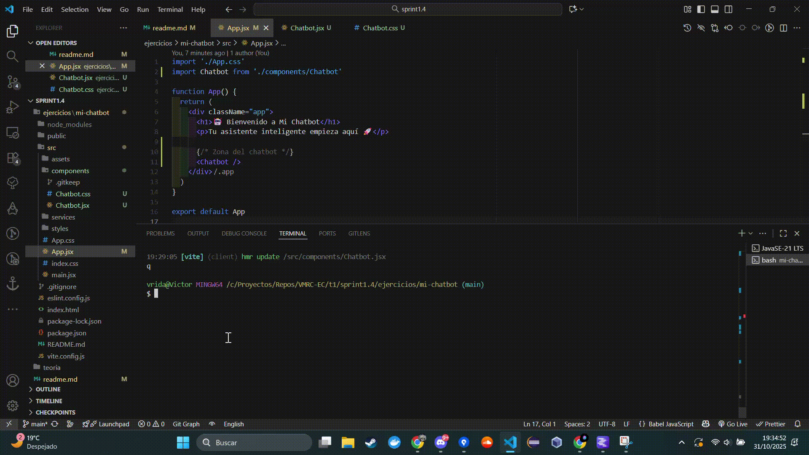

# Actividad 1: Creación del Proyecto del Chatbot

## 🧩 Historia de Usuario
**Como** estudiante de desarrollo web,  
**quiero** crear un proyecto base en React que funcione correctamente en mi navegador,  
**para** tener una base estable sobre la que construir mi chatbot en las siguientes actividades.

---

## 🧱 Tareas realizadas

### 1️⃣ Creación del proyecto React
- Proyecto creado con Vite y React.
- Dependencias instaladas correctamente.
- Comprobación de arranque inicial exitosa.

### 2️⃣ Ejecución y verificación del entorno
- Servidor de desarrollo arrancado con `npm run dev`.
- Proyecto visible en `http://localhost:5173/`.
- No se observaron errores en consola.

### 3️⃣ Personalización inicial del proyecto
- Se modificó `App.jsx` para mostrar el nombre y logotipo provisional del chatbot:
  - Texto mostrado: "🤖 Bienvenido a Mi Chatbot"  
  - Logo provisional agregado en `public/assets/logo.png` (opcional).

### 4️⃣ Preparación de la estructura base
Estructura de carpetas creada para organizar el proyecto:

```
src/
├── App.jsx
├── main.jsx
├── components/
├── services/
├── styles/
public/
└── assets/

```

## También se añaden los ".gitkeep" opcionales para mantener carpetas vacías en Git.

### 5️⃣ Evidencia del funcionamiento
A continuación se muestran las capturas/GIFs que documentan cada prueba:



-------------------------------------------------------------------------------------------------

# Actividad 2 – Personalización Visual del Chatbot

## 🧠 Tareas

### 🎨 Tarea 1: Identidad visual del chatbot

Definición del nombre, eslogan y selección de imagen/logotipo para SHODAN.

### 🖼 Tarea 2: Sustitución de elementos genéricos

Eliminados todos los recursos visuales de React y reemplazados por los propios del chatbot.

### 🧭 Tarea 3: Ajuste visual mínimo

Adaptación de la interfaz para mostrar el nombre, imagen y eslogan del chatbot de forma centrada y limpia.

### 🗂 Tarea 4: Organización de recursos gráficos

Estructura final:

```
public/
 └── assets/
     ├── images/
     │   └── shodan.gif
     └── icons/
         └── favicon.ico
```

### 📝 Tarea 5: Reflejar la identidad en la interfaz

Se ha integrado el logotipo animado, el nombre “SHODAN” y el eslogan en la pantalla principal.
También se añadió un **favicon personalizado** para reforzar la identidad del asistente.

---

## 🧪 Pruebas funcionales

**Prueba:**
Verificar que la aplicación muestra correctamente la nueva identidad visual sin elementos de React.

**Resultado:**

* La aplicación carga mostrando la identidad de SHODAN.
* Logo, nombre y eslogan visibles.
* Estructura modular y organizada según lo requerido.

---

## 5️⃣ Evidencia del funcionamiento

A continuación se muestran las capturas/GIFs que documentan la actividad:


------------------------------------------------------------------------------------------

# Actividad 3: Estructura del Proyecto y Modularización

## Historia de usuario

**Como** estudiante que está profesionalizando su chatbot,
**quiero** organizar mi proyecto React en una estructura clara con carpetas separadas para componentes, estilos, servicios y recursos,
**para** poder seguir creciendo (chat, conexión a APIs, historial, etc.) sin que el código se vuelva caótico.

---

## 🧠 Objetivos de la actividad

* Organizar el proyecto por responsabilidad (interfaz, estilos, servicios, recursos).
* Aislar los componentes del chatbot dentro de su propia carpeta.
* Preparar la carpeta `services/` para futuras llamadas a datos (POKEAPI).
* Centralizar los estilos en una carpeta única.
* Integrar toda la estructura dentro de la aplicación principal (`App.jsx`).

---

## 🗂️ Estructura final del proyecto

```
mi-chatbot/
 ┣ 📂public
 ┃ ┗ 📂assets
 ┃   ┣ 📂images
 ┃   ┃ ┗ 📂icons
 ┃   ┗ 📂shodan
 ┃       ┗ 📜shodan.gif
 ┣ 📂src
 ┃ ┣ 📂components
 ┃ ┃ ┗ 📂Chatbot
 ┃ ┃   ┣ 📜ChatWindow.jsx
 ┃ ┃   ┣ 📜MessageList.jsx
 ┃ ┃   ┗ 📜MessageInput.jsx
 ┃ ┣ 📂services
 ┃ ┃ ┗ 📜pokeapi.js
 ┃ ┣ 📂styles
 ┃ ┃ ┣ 📜layout.css
 ┃ ┃ ┗ 📜chatbot.css
 ┃ ┣ 📜App.jsx
 ┃ ┣ 📜App.css
 ┃ ┣ 📜index.css
 ┃ ┗ 📜main.jsx
 ┣ 📜vite.config.js
 ┣ 📜package.json
 ┗ 📜README.md
```

---

## 🧱 Detalle de tareas

### 📂 Tarea 1: Estructurar el proyecto por responsabilidad

Se han creado carpetas específicas para cada responsabilidad:

* `components/` → componentes visuales reutilizables.
* `services/` → llamadas externas y futuras integraciones con APIs.
* `styles/` → estilos globales y específicos del chatbot.
* `public/assets/` → imágenes, íconos y recursos estáticos.

---

### 💬 Tarea 2: Aislar los componentes del chatbot

Dentro de `components/Chatbot/` se separaron las siguientes piezas:

* **ChatWindow.jsx** → Contenedor principal del chat.
* **MessageList.jsx** → Muestra la conversación.
* **MessageInput.jsx** → Campo de entrada del usuario.

Esto permite ampliar o modificar el comportamiento del chat sin afectar el resto de la aplicación.

---

### 🛰️ Tarea 3: Preparar carpeta `services/`

Se creó `services/pokeapi.js`, con la función preparada para futuras llamadas a la **POKEAPI**:

```js
// services/pokeapi.js
export async function getPokemonData(name) {
  console.log("Función getPokemonData preparada para futuras llamadas");
}
```

---

### 🎨 Tarea 4: Centralizar estilos

Se unificaron los estilos en la carpeta `styles/`:

* `layout.css` → estructura global de la aplicación.
* `chatbot.css` → diseño y apariencia del chatbot (colores, fondo, tipografía, avatar SHODAN, etc.).

Esto asegura coherencia visual y facilita modificaciones futuras.

---

### ⚙️ Tarea 5: Integrar todo en la aplicación raíz

`App.jsx` actúa como el punto de unión entre los componentes y estilos.
El chatbot (con su imagen y ventana de chat) se renderiza correctamente desde el navegador y mantiene su identidad visual.

---

##Prueba funcional

### 🎥 GIF de comprobación


# Actividad 4: Componentes Mínimos del Chatbot

## Historia de usuario

**Como** usuario que va a interactuar con el chatbot dentro de la aplicación,  
**quiero** disponer de una interfaz de chat que se parezca a una experiencia real (historial de mensajes, zona de escritura y área de respuesta del asistente),  
**para** poder conversar con el chatbot dentro del navegador de forma clara, ordenada y comprensible.

---

## Objetivos de la actividad

* Implementar la ventana principal del chat dentro de la aplicación.
* Mostrar un historial de mensajes claramente diferenciado entre usuario y asistente.
* Mantener un área de entrada de texto funcional para enviar mensajes.
* Simular respuestas del asistente para probar la interacción.
* Mostrar un indicador visual de “pensando…”.
* Aplicar identidad visual propia (avatar, colores, tipografía) al chat.

---

## Detalle de tareas

### 💬 Tarea 1: Ventana principal del chat
Se ha creado `ChatWindow.jsx` como contenedor de la conversación.  
El chat se integra dentro de la app y está claramente identificado como “Chatbot” con colores y diseño propios.

### 🗂 Tarea 2: Historial de mensajes
* `MessageList.jsx` muestra todos los mensajes en orden cronológico.  
* Mensajes del usuario y del bot se diferencian visualmente mediante colores y avatar.  
* Cada mensaje se representa como una burbuja claramente separada.

### ⌨️ Tarea 3: Área de entrada de mensaje
* `MessageInput.jsx` contiene un campo de texto y botón “Enviar”.  
* Siempre accesible en la parte inferior de la ventana del chat.  
* Permite enviar mensajes con Enter o pulsando el botón.

### 🤖 Tarea 4: Respuesta simulada del asistente
* Cada mensaje del usuario provoca una respuesta del bot simulada.  
* Las respuestas se generan de manera aleatoria para simular interacción real.

### ⏳ Tarea 5: Indicador de respuesta / “pensando…”
* Se muestra un mensaje temporal “Pensando...” antes de la respuesta del bot.  
* Indica que el asistente está procesando el mensaje.

### 👁 Tarea 6: Identidad visual del asistente
* Se utiliza el avatar `shodan.gif` y colores verdes y negros inspirados en estética retro.  
* Tipografía, bordes y burbujas están adaptados para que la experiencia sea clara y reconocible.

---

## Prueba funcional


