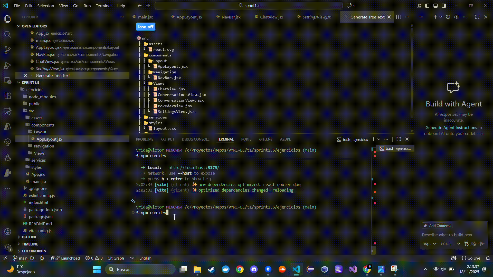
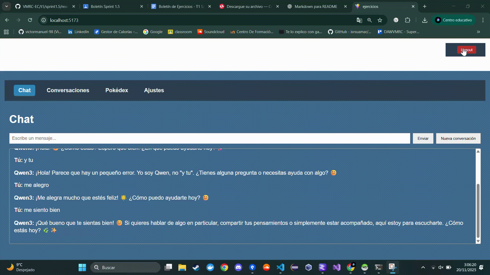
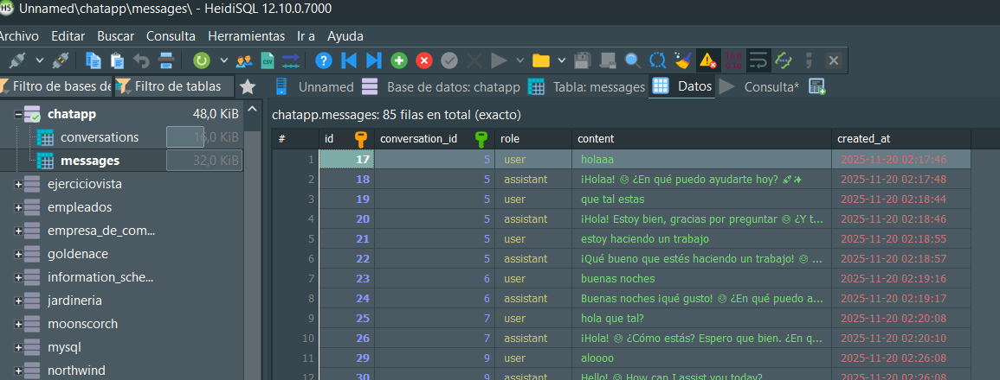
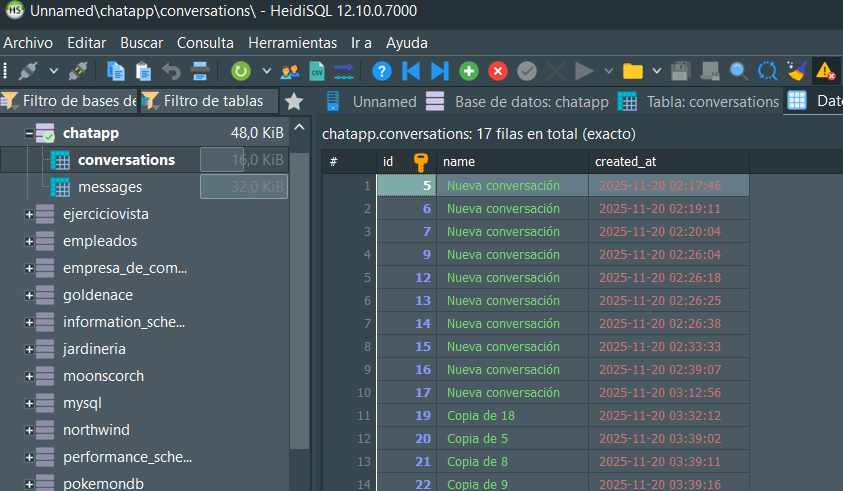

# ENTORNO CLIENTE: SPRINT 1.5 #

---

# Actividad 1 – Mapa de rutas y contenedores funcionales

## Historia de usuario
**Como** usuario que entra en la aplicación,  
**quiero** entender qué pantallas existen y moverme entre ellas,  
**para** acceder rápidamente al chat, a mis conversaciones, a la Pokédex y a los ajustes.

---

## Tareas realizadas

### Mapa de rutas
Se han definido las rutas principales de la aplicación:

| Ruta | Vista |
|------|-------|
| `/` | Chat (vista principal) |
| `/conversaciones` | Conversaciones (listado) |
| `/conversacion/:id` | Conversación (detalle con historial) |
| `/pokedex` | Pokédex (demostrador POKEAPI) |
| `/ajustes` | Ajustes (preferencias del asistente/modelo) |

---

### Contenedor visual común
- Se ha creado `AppLayout.jsx` que incluye:
  - Cabecera persistente (`header`)  
  - Área de contenido (`main`) donde se cargan las vistas

---

### Elementos de navegación
- Se ha creado `NavBar.jsx` con enlaces funcionales a todas las vistas.  
- Los enlaces funcionan con **clic** y **teclado (Tab + Enter)**.

---

## Estructura de carpetas

```
📦src
 ┣ 📂assets
 ┃ ┗ 📜react.svg
 ┣ 📂components
 ┃ ┣ 📂Layout
 ┃ ┃ ┗ 📜AppLayout.jsx
 ┃ ┣ 📂Navigation
 ┃ ┃ ┗ 📜NavBar.jsx
 ┃ ┗ 📂Views
 ┃ ┃ ┣ 📜ChatView.jsx
 ┃ ┃ ┣ 📜ConversationsView.jsx
 ┃ ┃ ┣ 📜ConversationView.jsx
 ┃ ┃ ┣ 📜PokedexView.jsx
 ┃ ┃ ┗ 📜SettingsView.jsx
 ┣ 📂services
 ┣ 📂styles
 ┃ ┗ 📜layout.css
 ┣ 📜App.jsx
 ┗ 📜main.jsx
```
---

## Pruebas funcionales realizadas
- ✅ Click en cada enlace cambia correctamente la vista.  
- ✅ La cabecera se mantiene estable mientras se navega.  
- ✅ Enlaces accesibles con teclado.  

---

## GIF de prueba



---

# Actividad 2 – Enrutado con parámetros, queries y estados

## Historia de usuario
**Como** persona que comparte enlaces,  
**quiero** que la URL refleje la vista actual y sus parámetros (id de conversación, filtros),  
**para** abrir directamente contenido concreto.

---

## Tareas realizadas

### Parámetros de ruta
- `ConversationView` acepta un `id` en la URL:  
  Ejemplo: `/conversacion/2`  
- Esto permite abrir directamente la conversación deseada.

### Query params funcionales
- `ConversationsView` interpreta:
  - `?q=` → búsqueda por nombre de conversación
  - `?sort=` → orden (`asc` / `desc`)
- Cambiar los controles de búsqueda/orden **actualiza la URL**.
- Abrir la URL directamente restaura los valores de los controles.

### Sincronía URL ⇄ Estado
- Los filtros y orden permanecen después de recargar la página.
- La URL refleja siempre el estado actual de los controles.

---

## Estructura de carpetas relevante
```
src/
├── components/
│ └── Views/
│ ├── ConversationsView.jsx
│ └── ConversationView.jsx
└── services/
└── url-state.md
```

---

## Pruebas funcionales realizadas
- ✅ Escribir/limpiar búsqueda actualiza la URL.
- ✅ Abrir una URL con `?q=` y `?sort=` muestra el listado filtrado/ordenado.
- ✅ Abrir directamente una conversación por su `id` funciona.

---

## GIF de prueba

_Añadir aquí el GIF que muestre:_
1. Filtrado con query param (`?q=` y `?sort=`)  
2. Recarga de la página  
3. Estado de filtros persistente


---

# Actividad 3: Rutas protegidas y login
- Login simulado
- Rutas protegidas: Chat, Conversaciones, Pokédex, Ajustes
- Redirecciones automáticas según sesión

**Pruebas**
- ✅ Sin sesión → redirige login
- ✅ Con sesión → acceso a rutas
- ✅ Logout → vista pública

## GIF de prueba


---

# Actividad 4 — Gestión del Historial, Scroll y Foco

1. **Historial:** Verificar que las acciones Atrás/Adelante recuperan vista y parámetros previos.
2. **Scroll:** Restaurar la posición del scroll al regresar a un listado (p. ej., *ConversationsView*).
3. **Foco:** Enfocar automáticamente:
   - El input al entrar en Chat.
   - Un elemento relevante al cambiar de vista.

## Estructura esperada
```
src/
├── components/
│ ├── Views/
│ │ └── ConversationsView.jsx
│ └── Feedback/
│ └── ScreenAnnouncer.jsx
└── styles/
└── layout.css
```
## Pruebas

- ✅ Navegar entre vistas y usar Atrás/Adelante mantiene estado/params.
- ✅ El scroll se restaura al volver a listados.
- ✅ El foco cae en el campo esperado.
- ✅ GIF: navegar a listado → bajar scroll → ir a detalle → volver → scroll restaurado.

## Gif de prueba


---

## Actividad 5 – Manejo unificado de Errores, 404 y Estados de Carga

- Tarea 1: Vista 404 funcional: Cualquier URL no declarada muestra NotFoundView.jsx.

- Tarea 2: Estados de carga homogéneos: Se ha creado el componente Loading.jsx dentro de components/Feedback.

- Tarea 3: Captura de error por vista: Nuevo componente ErrorBlock.jsx para mostrar errores sin romper la app.

En caso de fallo (ej.: API de POKEAPI caída), la vista muestra un mensaje local.

La navegación se mantiene totalmente operativa.

## Estructura de archivos
```
src/
 ├── components/
 │   ├── Views/
 │   │    └── NotFoundView.jsx
 │   └── Feedback/
 │        ├── Loading.jsx
 │        └── ErrorBlock.jsx
 ├── styles/
 │   ├── layout.css
 │   └── chatbot.css
public/
 └── assets/
```

## Pruebas

- ✅ Introducir una URL desconocida muestra la vista 404
- ✅ Estados de carga visibles durante peticiones reales
- ✅ Error de la API (POKEAPI) → muestra ErrorBlock sin romper la app
- ✅ GIF demostrativo:

### 1. Acceso a URL inexistente → 404 → volver a inicio



---

### 2. Forzar error de API → bloque de error en pantalla


---

# Actividad 6 – Deep-linking de conversación y navegación programática

- Tarea 1: Abrir conversación por URL. Se permite acceder directamente mediante /conversations/:id.

- Tarea 2: Navegación programática desde la UI

- Tarea 3: Estados vacíos. Si el id no existe, ConversationView.jsx muestra un estado tipo: “La conversación no existe” con un botón Volver a Conversaciones.

## Estructura de archivos
```
src/
 ├── components/
 │   ├── Chatbot/
 │   │    ├── ChatWindow.jsx
 │   │    ├── MessageList.jsx
 │   │    └── MessageInput.jsx
 │   └── Views/
 │        ├── ConversationsView.jsx
 │        └── ConversationView.jsx   # gestiona id inexistente/duplicado
 └── services/
      └── conversations.js           # contrato de lectura por id (doc)
```
## Pruebas

- ✅ Abrir por URL una conversación válida muestra el historial correctamente.
- ✅ “Nueva conversación” navega al ID recién creado.
- ✅ “Duplicar” crea un clon y navega hacia él.
- ✅ “Borrar” redirige al listado sin errores.
- ✅ Conversación inexistente muestra estado “no encontrada” + enlace de retorno.
- ✅ GIF demostrativo:

### 1. Copiar URL de conversación → pegar en otra pestaña → la conversación carga + Borrar → navegación automática al listado.


---

## Capturas de la Base de Datos de HeidiSQL

### 1. Tabla mensajes



---

### 2. Tabla conversaciones



