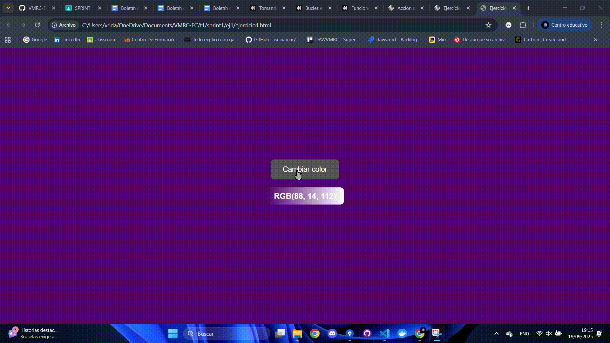
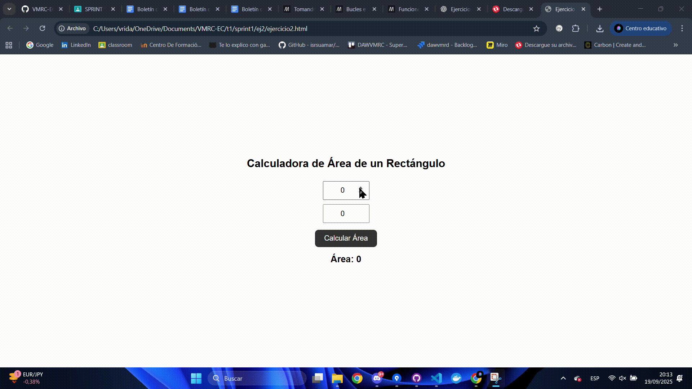
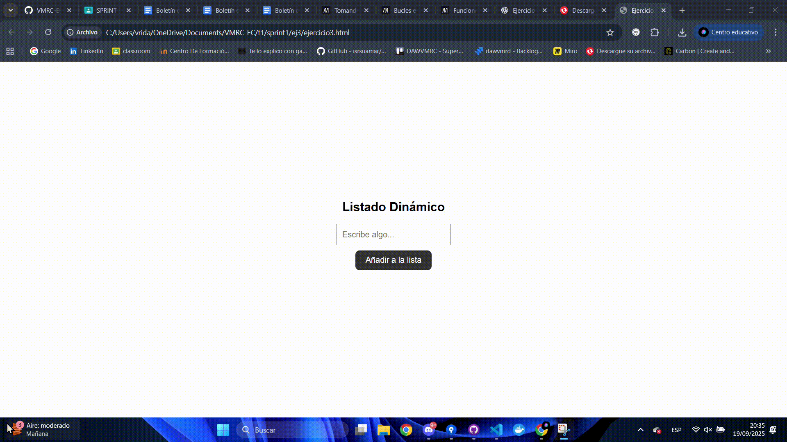
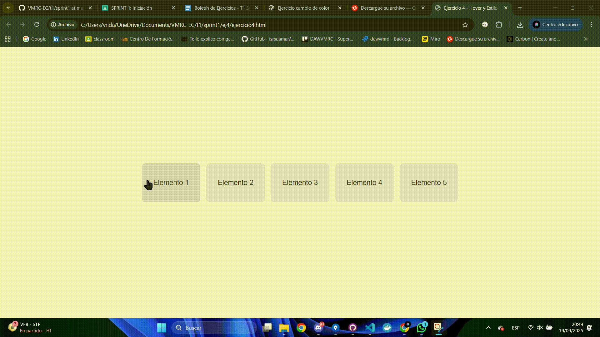

# Ejercicio 1 - Cambio de Color con Botón

Este ejercicio consiste en crear una página web donde, al pulsar un botón, el color de fondo de la página cambie a un color aleatorio y se muestre su valor RGB en una cajita con gradiente.

---

## Pasos realizados

1. **HTML básico**
   - Creamos un botón con el texto "Cambiar color".
   - Añadimos un párrafo que mostrará los valores RGB.
   - Centramos el botón y el texto usando `flexbox`.

2. **Estilos CSS**
   - Estilizamos el botón con padding, color, borde redondeado y efecto hover.
   - La cajita de texto tiene un **gradiente** y se ajusta el color del texto automáticamente según la luminosidad del fondo para asegurar contraste.

3. **JavaScript**
   - Seleccionamos el botón y el párrafo desde el DOM.
   - Creamos una función que genera un color aleatorio usando `Math.random()` para obtener valores RGB.
   - Al hacer clic en el botón:
     - Cambia el fondo de la página al color generado.
     - Actualiza el párrafo con el valor RGB.
     - Aplica un gradiente al fondo del párrafo basado en el color generado.
     - Ajusta el color del texto según la luminosidad del color para mantener legibilidad.

---

## Resultado

---

### Archivos entregables
- `ejercicio1.html` → Página web principal.
- `ejercicio1.js` → Script que controla el cambio de color y la actualización del texto.
- `ejercicio1gif.gif` → GIF mostrando el funcionamiento.

# Ejercicio 2 - Calculadora de Área de un Rectángulo

Este ejercicio consiste en crear una página web donde, al introducir el ancho y el alto de un rectángulo y pulsar un botón, se calcule su área y se muestre el resultado en la página.

---

## Pasos realizados

1. **HTML básico**
   - Creamos dos campos de entrada (`input`) para ancho y alto.
   - Añadimos un botón con el texto "Calcular Área".
   - Añadimos un párrafo `
` donde se mostrará el resultado.
   - Todo el contenido está centrado vertical y horizontalmente usando `flexbox`.

2. **Estilos CSS**
   - Los inputs y el botón tienen padding, tamaño de fuente y bordes redondeados.
   - El botón tiene un efecto hover para mejorar la interacción.
   - El resultado se muestra con tamaño de fuente más grande y en negrita.

3. **JavaScript**
   - Se seleccionan los elementos del DOM: inputs, botón y párrafo de resultado.
   - Función `calcularArea`:
     - Convierte los valores de los inputs a números.
     - Valida que ambos sean números.
     - Calcula el área usando `ancho * alto`.
     - Muestra el resultado en el párrafo.
   - Evento `click` en el botón para ejecutar la función.

---

## Resultado

Al pulsar el botón, se calcula el área del rectángulo y se muestra en la página.  

---

### Archivos entregables
- `ejercicio2.html` → Página web principal.  
- `ejercicio2.js` → Script que calcula el área y actualiza el resultado.  
- `ejercicio2gif.gif` → GIF mostrando el funcionamiento del ejercicio.

# Ejercicio 3 - Listado Dinámico

Este ejercicio consiste en crear una página web donde el usuario puede añadir elementos a una lista de manera dinámica.  

---

## Pasos realizados

1. **HTML básico**
   - Creamos un campo de entrada (`input`) para escribir el nuevo elemento.
   - Añadimos un botón con el texto "Añadir a la lista".
   - Creamos una lista vacía `<ul>` donde se agregarán los elementos.
   - Todo el contenido está centrado vertical y horizontalmente usando `flexbox`.

2. **Estilos CSS**
   - Los inputs y el botón tienen padding, tamaño de fuente y bordes redondeados.
   - El botón tiene un efecto hover.
   - La lista y los elementos `<li>` tienen márgenes para mejorar la visualización.

3. **JavaScript**
   - Se seleccionan los elementos del DOM: input, botón y lista.
   - Función `añadirElemento`:
     - Obtiene el texto del input y elimina espacios en blanco.
     - Valida que el texto no esté vacío.
     - Crea un nuevo elemento `<li>` usando `document.createElement`.
     - Asigna el texto al `<li>` y lo añade a la lista con `appendChild`.
     - Limpia el input para el siguiente elemento.
   - Se añade un evento `click` al botón para ejecutar la función.
   - También se añadió la opción de pulsar `Enter` para añadir un elemento.

---

## Resultado

Al escribir un texto en el campo y pulsar el botón, el elemento se añade a la lista de manera dinámica.  

---

### Archivos entregables
- `ejercicio3.html` → Página web principal.  
- `ejercicio3.js` → Script que añade elementos a la lista.  
- `ejercicio3gif.gif` → GIF mostrando cómo se añaden 3 elementos a la lista.

# Ejercicio 4 - Hover y Estilo Dinámico

Este ejercicio consiste en crear una página web con varios elementos `
` donde, al pasar el ratón sobre ellos, se cambia su estilo dinámicamente y al salir se restauran los estilos originales.

---

## Pasos realizados

1. **HTML básico**
   - Creamos varios `
` con la clase `miDiv` y con textos diferentes.
   - Todos los divs están centrados y distribuidos usando `flexbox` con `flex-wrap` para varias filas.

2. **Estilos CSS**
   - Los divs tienen tamaño fijo, color de fondo y color de texto originales.
   - Se añadieron bordes redondeados, cursor tipo puntero y transición suave (`transition`) para animar los cambios de color.

3. **JavaScript**
   - Se seleccionan todos los divs con `querySelectorAll`.
   - Se recorre cada div para añadir dos eventos:
     - `mouseover`: al pasar el ratón, cambia el fondo a azul y el texto a blanco. Además, guarda los estilos originales usando `dataset` para poder restaurarlos.
     - `mouseout`: al salir el ratón, restaura los estilos originales guardados.

---

## Resultado

Al pasar el ratón sobre cada div, su fondo cambia a azul y el texto a blanco, y al mover el ratón fuera del div, se restauran los estilos originales.  

---

### Archivos entregables
- `ejercicio4.html` → Página web principal.  
- `ejercicio4.js` → Script que gestiona los eventos de hover y restaura estilos.  
- `ejercicio4gif.gif` → GIF mostrando cómo al pasar por encima cambia el fondo y el texto, y se restaura al salir.

